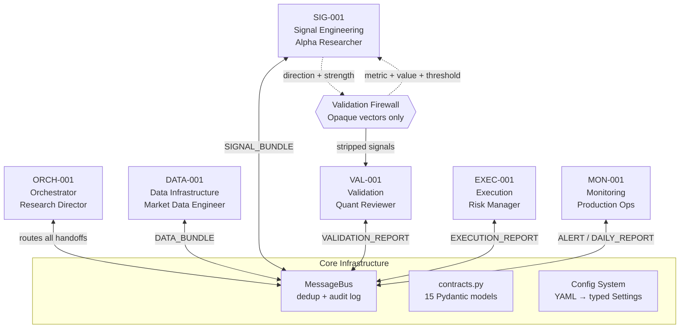
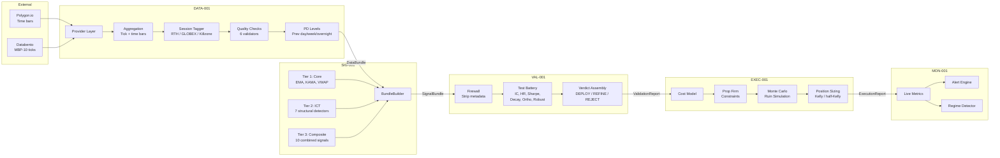
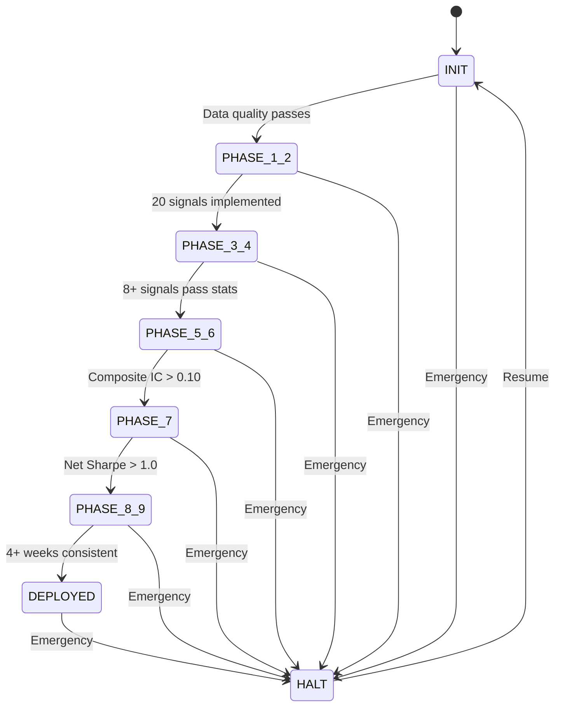
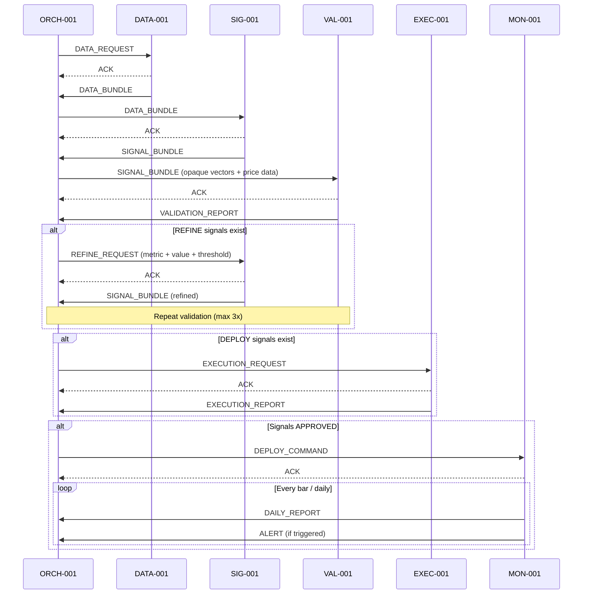

# Architecture — Alpha Signal Research Lab

A multi-agent quantitative trading research system for discovering, validating, and monitoring profitable signals in **NQ/ES CME futures markets**. Built for prop firm environments (Apex Trader Funding, Topstep), the system routes market data through a 6-agent pipeline with a statistical validation firewall that prevents overfitting. The guiding thesis: discover multi-timeframe confluence signals that survive real-world transaction costs and prop firm risk constraints.

---

## System Overview

Six specialist agents communicate through a centralized MessageBus with deduplication and a full audit log. The Orchestrator sequences a multi-phase pipeline from raw market data to deployed, monitored signals.



---

## Agents

All agents extend `BaseAgent` (`core/agent_base.py`), which provides identity, a state machine (IDLE ↔ PROCESSING ↔ ERROR), message send/receive via the bus, and convenience methods for ACK, NACK, and escalation.

### ORCH-001 — Orchestrator

| | |
|---|---|
| **Module** | `agents/orchestrator/` |
| **Role** | Sequences the multi-phase pipeline, routes messages between agents, resolves inter-agent conflicts, makes go/no-go decisions at phase boundaries, maintains a decision audit log. |
| **Receives** | `DATA_BUNDLE`, `SIGNAL_BUNDLE`, `VALIDATION_REPORT`, `EXECUTION_REPORT`, `ALERT`, `REGIME_SHIFT` |
| **Produces** | `DATA_REQUEST`, `REFINE_REQUEST`, `EXECUTION_REQUEST`, `DEPLOY_COMMAND`, `HALT_COMMAND` |
| **Key files** | `agent.py` (routing + conflict resolution), `pipeline.py` (PipelineManager state machine) |

Conflict resolution hierarchy: **EXEC-001 > VAL-001 > SIG-001** — unprofitable execution renders validation moot; statistical evidence overrides signal intuition.

### DATA-001 — Data Infrastructure

| | |
|---|---|
| **Module** | `agents/data_infra/` |
| **Role** | Owns the data pipeline from raw exchange feeds to clean, session-tagged OHLCV bars at 11 timeframes (987t, 2000t, 1m, 3m, 5m, 10m, 15m, 30m, 1H, 4H, 1D). |
| **Receives** | `DATA_REQUEST` |
| **Produces** | `DataBundle` (bars dict, sessions, PD levels, quality report) |
| **Key files** | `agent.py`, `aggregation.py` (bar construction), `sessions.py` (RTH/GLOBEX + killzones), `quality.py` (6 validators), `tick_store.py` (DuckDB + Parquet), `providers/polygon.py`, `providers/databento.py` |

The `TickStore` enforces hard time boundaries to prevent look-ahead bias. Providers auto-detect the front-month CME contract and cache fetched data as Parquet files.

### SIG-001 — Signal Engineering

| | |
|---|---|
| **Module** | `agents/signal_eng/` |
| **Role** | Runs 20 signal detectors across 3 tiers. Normalizes output to direction [-1, +1] and strength [0, 1]. Handles REFINE feedback loops (max 3 iterations per signal). |
| **Receives** | `DATA_BUNDLE`, `REFINE_REQUEST` |
| **Produces** | `SignalBundle` (list of `SignalVector` objects) |
| **Key files** | `agent.py`, `detector_base.py` (ABC + auto-registration), `bundle_builder.py` (runs all detectors), `indicators.py` (shared computations: EMA, ATR, KAMA, VWAP, swing pivots) |

Detectors auto-register via `__init_subclass__`. The firewall forbids sharing parameters or categories with VAL-001.

### VAL-001 — Validation

| | |
|---|---|
| **Module** | `agents/validation/` |
| **Role** | The statistical firewall against overfitting. Runs a 6-test battery on every signal. Issues DEPLOY/REFINE/REJECT verdicts. Applies Bonferroni correction. Flags suspected look-ahead bias (IC > 0.20). |
| **Receives** | `SIGNAL_BUNDLE` (opaque vectors only — metadata stripped by firewall) |
| **Produces** | `ValidationReport` with `SignalVerdict` per signal |
| **Key files** | `firewall.py` (strip metadata, run battery, assemble verdict), `tests/` (ic_testing, hit_rate, risk_adjusted, decay_analysis, orthogonality, robustness) |

VAL-001 never sees signal parameters, category names, or indicator types.

### EXEC-001 — Execution & Risk

| | |
|---|---|
| **Module** | `agents/execution/` |
| **Role** | Validates DEPLOY signals against real-world execution constraints. Transaction cost modeling, turnover analysis, prop firm feasibility, Monte Carlo ruin simulation, position sizing (Kelly / half-Kelly). |
| **Receives** | `EXECUTION_REQUEST` |
| **Produces** | `ExecutionReport` with `ExecVerdict` (APPROVED / VETOED) |
| **Key files** | `cost_model.py`, `prop_constraints.py`, `position_sizing.py`, `monte_carlo.py` |

EXEC overrides VAL in conflicts — a signal with great stats but unprofitable execution is worthless.

### MON-001 — Monitoring

| | |
|---|---|
| **Module** | `agents/monitoring/` |
| **Role** | Continuous tracking of deployed signals. Rolling IC/hit rate/Sharpe monitoring. 4-level alert system (INFO → WARNING → CRITICAL → HALT). Regime classification. Prop firm buffer tracking. Mandatory daily reports. |
| **Receives** | `DEPLOY_COMMAND` |
| **Produces** | `MonitoringReport`, `ALERT`, `REGIME_SHIFT`, `DAILY_REPORT` |
| **Key files** | `metrics.py`, `alerts.py`, `regime.py` (TRENDING/RANGING/VOLATILE/TRANSITIONAL), `dashboard.py` |

HALT alerts trigger an emergency pipeline stop. Signal health is classified as HEALTHY / DEGRADING / FAILING.

---

## Data Flow



---

## Design Patterns

### Validation Firewall

The strict information boundary between SIG-001 and VAL-001 prevents overfitting by ensuring the signal engineer cannot reverse-engineer what the validator looks for. In `firewall.py`, `strip_signal_metadata()` passes only `signal_id`, `direction`, `strength`, and `timeframe` across the boundary — parameters, category names, and metadata are stripped. Feedback to SIG-001 is limited to `(metric_name, value, threshold)` tuples via the `failed_metrics` field in `SignalVerdict`.

### Auto-Registering Signal Detectors

Any concrete subclass of `SignalDetector` (`detector_base.py`) that defines `detector_id` in its class body automatically registers in `SignalDetectorRegistry._detectors` via `__init_subclass__`. The `detectors/__init__.py` file imports all three tier packages, triggering registration at import time. `bundle_builder.py` iterates `SignalDetectorRegistry.get_all()` to discover and run all detectors — adding a new detector is a single-file operation.

### MessageBus

`MessageEnvelope` (`message.py`) is a typed Pydantic model wrapping every inter-agent communication with `sender`, `receiver`, `message_type`, `priority`, `request_id`, `payload`, and `metadata`. The `MessageBus` routes by receiver `AgentID`, deduplicates by `(request_id, message_type, sender)`, and appends every message to an audit log for orchestrator visibility. 16 message types are defined in the `MessageType` enum.

### Conflict Resolution

The hierarchy is: **EXEC-001 > VAL-001 > SIG-001**. Statistical evidence overrides signal intuition (VAL > SIG), but unprofitable execution renders validation moot (EXEC > VAL). When MON-001 raises a CRITICAL alert or detects a regime shift, the orchestrator pauses deployment and requests diagnostics from all agents.

### BaseAgent State Machine

Every agent inherits from `BaseAgent` (`agent_base.py`): identity (`AgentID`), state transitions (IDLE → PROCESSING → IDLE or ERROR), message send/receive via the bus, and convenience methods for ACK, NACK, and escalation to ORCH-001. The state machine provides a uniform lifecycle across all 6 agents.

---

## Signal Detectors

20 detectors across 3 tiers. Tier 3 composites depend on Tier 1 and Tier 2 outputs.

| Tier | ID | Description |
|------|----|-------------|
| 1 — Core | `ema_confluence` | 13/48/200 EMA alignment, crossover velocity, spread |
| 1 — Core | `kama_regime` | Kaufman Adaptive MA slope, price divergence, adaptive smoothing |
| 1 — Core | `vwap_deviation` | Session-anchored VWAP, std dev bands, slope |
| 2 — ICT | `liquidity_sweeps` | High/low sweep detection with reclaim confirmation |
| 2 — ICT | `fair_value_gaps` | Three-candle FVG identification and fill tracking |
| 2 — ICT | `ifvg` | Inverse FVG (failed FVG) detection |
| 2 — ICT | `market_structure` | Break of structure (BOS), change of character (CHOCH) |
| 2 — ICT | `killzone_timing` | Time-of-day bias scoring per killzone window |
| 2 — ICT | `pd_levels_poi` | Previous day/week level proximity scoring |
| 2 — ICT | `tick_microstructure` | Order flow imbalance from book data |
| 3 — Composite | `multi_tf_confluence` | Cross-timeframe signal agreement |
| 3 — Composite | `ema_vwap_interaction` | EMA trend + VWAP deviation combination |
| 3 — Composite | `displacement` | Large-body candle momentum detection |
| 3 — Composite | `order_blocks` | ICT order block identification + FVG overlap |
| 3 — Composite | `volume_profile` | POC, value area, volume node analysis |
| 3 — Composite | `scalp_entry` | Multi-signal scalp entry timing |
| 3 — Composite | `sweep_fvg_combo` | Liquidity sweep followed by FVG fill |
| 3 — Composite | `ema_reclaim` | EMA rejection/reclaim pattern detection |
| 3 — Composite | `session_gap` | Overnight gap fill probability |
| 3 — Composite | `adaptive_regime` | Regime-adaptive signal weighting |

An additional `ml_extrema_classifier` (Tier 3) uses a CatBoost model trained via walk-forward validation in the `agents/data_infra/ml/` pipeline.

All signals output `SignalVector` with `direction` in [-1, 0, +1] and `strength` in [0, 1]. No look-ahead bias is permitted — signals are strictly point-in-time.

---

## Pipeline State Machine

The orchestrator manages a multi-phase pipeline with go/no-go criteria at each boundary. Any phase can transition to HALT on emergency.



### Phase Transition Criteria

| From | To | Go/No-Go Criteria | Active Agents |
|------|----|-------------------|---------------|
| INIT | PHASE_1_2 | `data_quality_passed` | DATA-001 |
| PHASE_1_2 | PHASE_3_4 | `signals_implemented`, `unit_tests_pass` | DATA-001, SIG-001 |
| PHASE_3_4 | PHASE_5_6 | `deploy_count >= 8`, `min_ic_tstat`, `min_hit_rate`, `min_sharpe` | VAL-001 |
| PHASE_5_6 | PHASE_7 | `composite_ic > 0.10`, `regime_weights_validated` | SIG-001, VAL-001 |
| PHASE_7 | PHASE_8_9 | `net_sharpe > 1.0`, `prop_firm_feasible`, `mc_ruin < 0.05` | EXEC-001 |
| PHASE_8_9 | DEPLOYED | `4+ weeks consistent`, `no_critical_alerts` | MON-001, EXEC-001 |

---

## Message Flow

A full pipeline run follows this sequence. The REFINE loop can repeat up to 3 times per signal.



---

## Project Structure

```
src/alpha_lab/
  core/
    agent_base.py            # BaseAgent ABC — state machine, send/receive
    config.py                # YAML loader → typed Pydantic Settings
    contracts.py             # 15 Pydantic models — single source of truth
    enums.py                 # All enumerations (AgentID, Timeframe, Verdict, ...)
    exceptions.py            # Custom exception hierarchy
    logging.py               # Structured logging setup
    message.py               # MessageEnvelope + MessageBus (dedup, audit)

  agents/
    orchestrator/
      agent.py               # Message routing + conflict resolution
      pipeline.py            # PipelineManager — state machine + go/no-go

    data_infra/
      agent.py               # build_data_bundle() orchestration
      aggregation.py         # Tick bar + time bar construction
      sessions.py            # RTH/GLOBEX tagging, killzone classification
      quality.py             # 6 quality validators → QualityReport
      tick_store.py          # DuckDB + Parquet query layer (no look-ahead)
      ingest.py              # Data ingestion utilities
      ml_export.py           # ML feature export
      providers/
        base.py              # DataProvider ABC
        polygon.py           # Polygon.io adapter (time bars, front-month auto-detect)
        databento.py         # Databento adapter (MBP-10 ticks + OHLCV)
        stub.py              # Test stub provider
      ml/                    # ML extrema classification pipeline
        config.py            # Hyperparameters
        dataset_builder.py   # Training set assembly
        extrema_detection.py # Local min/max detection
        features_*.py        # Feature engineering (3 modules)
        labeling.py          # Label generation
        model_trainer.py     # CatBoost training
        model_evaluator.py   # Evaluation metrics
        walk_forward.py      # Walk-forward validation

    signal_eng/
      agent.py               # SignalEngineeringAgent
      bundle_builder.py      # Runs all detectors, assembles SignalBundle
      detector_base.py       # SignalDetector ABC + auto-registration
      indicators.py          # Shared indicators (EMA, ATR, KAMA, VWAP, swings)
      detectors/
        tier1/               # 3 Core detectors
        tier2/               # 7 ICT Structural detectors + _fvg_helpers.py
        tier3/               # 10 Composite detectors + ml_extrema_classifier

    validation/
      agent.py               # ValidationAgent
      firewall.py            # Strip metadata, test battery, verdict assembly
      tests/                 # 6 statistical tests (IC, HR, risk, decay, ortho, robust)

    execution/
      agent.py               # ExecutionAgent
      cost_model.py          # Transaction cost analysis (NQ/ES)
      prop_constraints.py    # Apex/Topstep feasibility checks
      position_sizing.py     # Kelly / half-Kelly sizing
      monte_carlo.py         # Ruin probability simulation

    monitoring/
      agent.py               # MonitoringAgent
      alerts.py              # Alert evaluation engine
      dashboard.py           # Daily report assembly
      metrics.py             # Rolling metric computation
      regime.py              # Regime classification + transition detection

config/
  settings.yaml              # Provider, symbols, timeframes, killzones, sessions
  instruments.yaml           # NQ/ES contract specs (tick size, commissions)
  prop_firms.yaml            # Apex/Topstep constraint profiles
  validation_thresholds.yaml # IC, hit rate, Sharpe, decay thresholds

docs/
  agent_prompts/             # Behavioral spec per agent (6 .md files)
  pipeline_state.yaml        # Development progress tracker
  DECISIONS.md               # Architectural decision log (13 decisions)

scripts/
  dashboard.py               # Streamlit dashboard
  ml_training_tab.py         # ML training UI
```

---

## Contracts

All inter-agent data structures are Pydantic v2 models defined in `core/contracts.py` — the single source of truth.

| Contract | Producer | Consumer | Purpose |
|----------|----------|----------|---------|
| `QualityReport` | DATA-001 | ORCH-001 | Data quality validation results |
| `SessionMetadata` | DATA-001 | SIG-001 | Session context (RTH/GLOBEX, killzone) |
| `PreviousDayLevels` | DATA-001 | SIG-001 | Reference levels from prior sessions |
| `DataBundle` | DATA-001 | SIG-001 | Clean OHLCV bars at all timeframes |
| `SignalVector` | SIG-001 | VAL-001 | Single signal output (direction + strength) |
| `SignalBundle` | SIG-001 | VAL-001 | Collection of all signal vectors |
| `SignalVerdict` | VAL-001 | ORCH-001 | Per-signal DEPLOY/REFINE/REJECT verdict |
| `ValidationReport` | VAL-001 | ORCH-001 | Full validation results + portfolio analysis |
| `CostAnalysis` | EXEC-001 | ORCH-001 | Transaction cost breakdown |
| `PropFirmFeasibility` | EXEC-001 | ORCH-001 | Prop firm constraint check results |
| `ExecVerdict` | EXEC-001 | ORCH-001 | Per-signal APPROVED/VETOED verdict |
| `ExecutionReport` | EXEC-001 | ORCH-001, MON-001 | Full execution analysis |
| `Alert` | MON-001 | ORCH-001 | Individual alert (INFO/WARNING/CRITICAL/HALT) |
| `SignalHealthReport` | MON-001 | ORCH-001 | Live health metrics per deployed signal |
| `MonitoringReport` | MON-001 | ORCH-001 | Real-time or daily summary |

`MessageEnvelope` (from `message.py`) is the transport wrapper for all of the above.

---

## Configuration

Four YAML files in `config/` are loaded at startup by `core/config.py` into a typed `Settings` object.

| File | Key Contents |
|------|-------------|
| `settings.yaml` | Data provider (`polygon`), symbols (NQ, ES), 11 timeframes, killzone windows (ET), session boundaries, pipeline run mode |
| `instruments.yaml` | NQ: tick $0.25 / $5.00 value / $7.78 RT cost. ES: tick $0.25 / $12.50 value / $8.41 RT cost. Session hours (ET) |
| `prop_firms.yaml` | Apex 50K/100K, Topstep 50K/150K profiles: trailing DD, daily loss limits, max contracts, consistency rules |
| `validation_thresholds.yaml` | IC t-stat min (2.0), hit rate min (0.51), Sharpe min (1.0), max DD (15%), profit factor min (1.2), max factor correlation (0.30), MC ruin max (5%) |

---

## Technology Stack

- **Language**: Python 3.11+ (deployed on 3.13)
- **Data modeling**: Pydantic v2, PyYAML
- **Data processing**: pandas, numpy, scipy
- **Data providers**: polygon-api-client, databento
- **Storage**: DuckDB (in-memory tick queries), Parquet (file cache)
- **Machine Learning**: CatBoost, scikit-learn
- **Visualization**: Streamlit, Plotly
- **Dev tools**: pytest, ruff, mypy

---

## Implementation Status

| Component | Status | Notes |
|-----------|--------|-------|
| Core Infrastructure | Complete | Contracts, MessageBus, BaseAgent, Config, Enums |
| DATA-001 Agent | Complete | Polygon + Databento providers, aggregation, sessions, quality, TickStore |
| SIG-001 Tier 1 (3 detectors) | Complete | EMA Confluence, KAMA Regime, VWAP Deviation |
| SIG-001 Tier 2 (7 detectors) | Complete | All 7 ICT structural detectors |
| SIG-001 Tier 3 (10 detectors) | Complete | All composite detectors |
| ML Pipeline | Complete | CatBoost extrema classifier, feature engineering, walk-forward |
| VAL-001 Agent | Complete | Firewall + 6-test battery + verdict assembly |
| EXEC-001 Agent | Complete | Cost model, position sizing, Monte Carlo, prop constraints |
| MON-001 Agent | Complete | Alerts, regime detection, metrics, daily reports |
| ORCH-001 Agent | Complete | Message routing, conflict resolution, pipeline state machine |
| Streamlit Dashboard | In Progress | Main dashboard + ML training tab |
